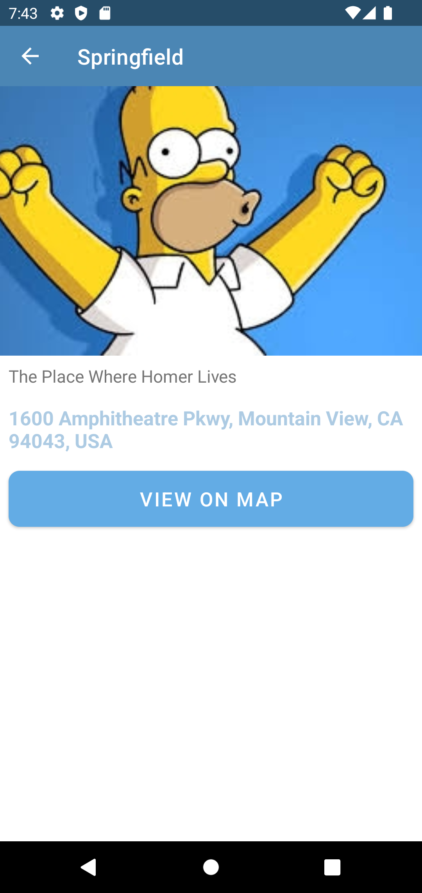

# Happy Places

This repo is based off the course titled "The Complete Android 12 & Kotlin Development Masterclass". You can find that course by following this link: https://www.udemy.com/course/android-kotlin-developer/

## Setup

1. Install Android Studio
2. Pull this code or download it on your local machine
3. Open your downloaded copy of this application from Android Studio
4. Run the application

## Screenshots

### Main activity

|Empty main activity|Main activity with list items|Swipe to edit on main activity|Swipe to delete on main activity|
|-|-|-|-|
|||||

### Add and edit activity

|Add details not populated|Add details populated|Choose image from gallery or camera|Choose location using Google Places API|
|-|-|-|-|
|||||

### View details

|View details|View location on Google Map|
|-|-|
|||
