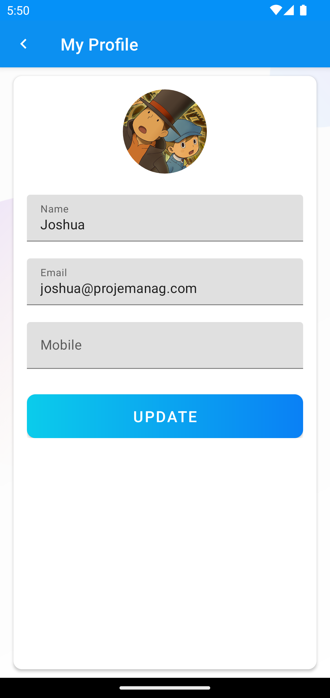
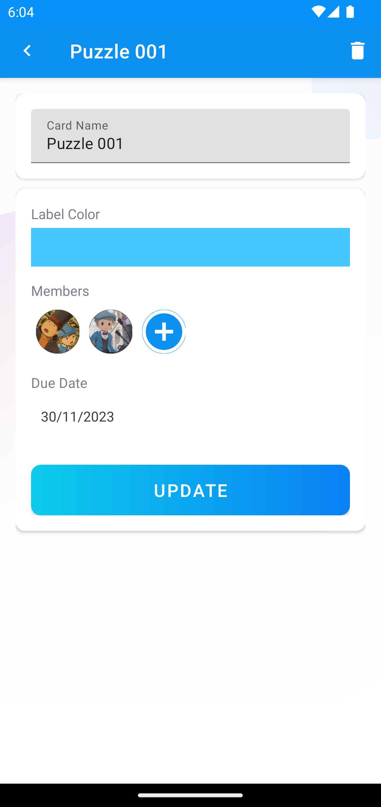

# Projemanag

This repo is based off the course titled "The Complete Android 12 & Kotlin Development Masterclass". You can find that course by following this link: https://www.udemy.com/course/android-kotlin-developer/

## Setup

1. Install Android Studio
2. Pull this code or download it on your local machine
3. Open your downloaded copy of this application from Android Studio
4. Run the application

## Screenshots

### Sign up and Sign in

|Intro|Sign up|Sign in|
|-|-|-|
||||

### Main page

|Slide out menu|My Profile|Empty boards list|Create board|Populated boards list|
|-|-|-|-|-|
||||||

### Cards list page

|Add cards list|Add card|Select Members|Add member|
|-|-|-|-|
|||||

### Card detail page

|Select label colour|Select members|Select due date|Details|Members in updated card|
|-|-|-|-|-|
||||||
