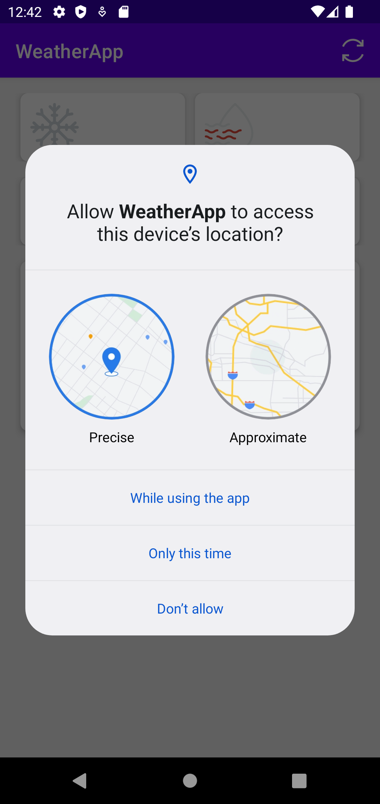
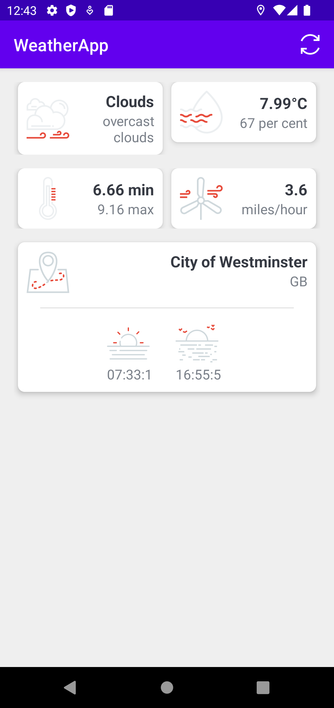
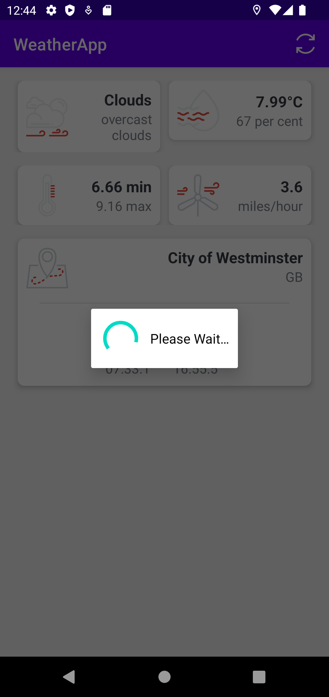

# Weather App

This repo is based off the course titled "The Complete Android 12 & Kotlin Development Masterclass". You can find that course by following this link: https://www.udemy.com/course/android-kotlin-developer/

## Setup

1. Install Android Studio
2. Pull this code or download it on your local machine
3. Open your downloaded copy of this application from Android Studio
4. Create a free Open Weather API key from the Open Weather website
    - The link to that website is https://openweathermap.org
5. Copy the API Key and paste it as the value for the constant "APP_ID"
    - That constant can be found inside the file Constants.kt
    - The Constants.kt file can be found inside the folder app/src/main/java/com/joshuawaheed/weatherapp/utils
6. Run the application

## Screenshots

|Asks for permission to access the location|Shows the weather on the UI after it has been loaded|Shows a loading dialog when loading data|
|-|-|-|
||||